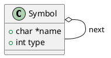
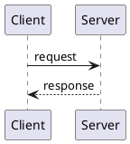
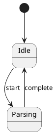

# Diagrams Directory

This directory contains diagrams for c-xrefactory documentation.

## Directory Structure

```
diagrams/
├── src/                          # Source PlantUML files (hand-written)
│   ├── symbol-structures.puml    # Custom diagram sources
│   └── buffer-structures.puml
├── symbol-structures.svg         # Generated images (working directory)
├── buffer-structures.svg
└── structurizr-*.puml           # Exported from workspace.dsl (for HTML generation)

docs/diagrams/                    # Copied SVGs for Structurizr import
├── symbol-structures.svg         # Generated + copied here (Structurizr imports from docs/ tree)
└── buffer-structures.svg
```

## Two Types of Diagrams

### 1. C4 Architecture Diagrams (Structurizr)

High-level architectural views defined in `../workspace.dsl`:
- System Context
- Container View
- Component Views

**These are managed in workspace.dsl**, not as separate files here.

### 2. Custom Detail Diagrams (PlantUML)

Detailed class diagrams, sequence diagrams, etc. for documentation chapters:
- **Source**: `src/*.puml` (hand-written PlantUML)
- **Generated**: `*.svg` (created by `make diagrams`)
- **Used in**: `docs/*.adoc` files

## Workflow

### Creating a New Diagram

1. **Create source file** in `src/`:
   ```bash
   cd doc/diagrams/src
   vi my-diagram.puml
   ```

2. **Write PlantUML** (see examples in this directory):
   ```plantuml
   @startuml
   class Foo {
     +int bar
   }
   @enduml
   ```

3. **Generate image**:
   ```bash
   cd ../..  # Back to doc/
   make diagrams
   ```

   This creates `diagrams/my-diagram.svg`

4. **Reference in documentation** (`docs/*.adoc`):
   ```asciidoc
   .My Diagram Title
   image::diagrams/my-diagram.svg[alt text,width=600]
   ```

   Note: Images are copied to `docs/diagrams/` so Structurizr can import them (the `!docs` keyword imports all images from the docs tree)

5. **View in Structurizr**:
   ```bash
   make view  # Generates diagrams and starts viewer
   ```

   Navigate to http://localhost:8080 → Documentation

### Automatic Generation

The workflow is optimized for efficiency:

- `make view` automatically generates diagrams before starting Structurizr
- Only regenerates if `.puml` source is newer than `.svg` (make dependency tracking)
- Generated `.svg` files should be committed to git for CI/GitHub Pages

### Iterating on Diagrams

When editing a diagram:

```bash
# Edit the source
vi diagrams/src/my-diagram.puml

# Regenerate (only regenerates changed diagrams)
make diagrams

# Refresh browser - Structurizr Lite will show updated image
```

## PlantUML Examples

### Class Diagram


### Sequence Diagram


### State Diagram


## PlantUML Resources

- [PlantUML Class Diagram Syntax](https://plantuml.com/class-diagram)
- [PlantUML Sequence Diagram Syntax](https://plantuml.com/sequence-diagram)
- [PlantUML State Diagram Syntax](https://plantuml.com/state-diagram)
- [PlantUML Component Diagram Syntax](https://plantuml.com/component-diagram)

## Generated Files in Git

**Should be committed:**
- `src/*.puml` (source files)
- `*.svg` (generated images - needed for CI/GitHub Pages)

**Should NOT be committed:**
- None - both sources and generated files should be in git for portability

The generated `.svg` files are committed because:
1. GitHub Pages needs them (CI doesn't run PlantUML)
2. Makes diffs visible in pull requests
3. Works offline without Docker/PlantUML installed

## Integration with Documentation

In your `.adoc` files (e.g., `docs/10-datastructures.adoc`):

**Important**: Images are automatically copied to `docs/diagrams/` by the Makefile, so use relative paths from within the `docs/` directory.

### Simple Image Reference
```asciidoc
image::diagrams/symbol-structures.svg[]
```

### With Title and Size
```asciidoc
.Symbol and Reference Relationships
image::diagrams/symbol-structures.svg[Symbol structures,width=800]
```

### Inline (Smaller)
```asciidoc
This is explained in image:diagrams/symbol-structures.svg[diagram,width=300].
```

### Why docs/diagrams/?

Structurizr Lite's `!docs docs` keyword imports all images from the docs directory tree. Images outside `docs/` are not imported, so the Makefile automatically copies generated SVGs from `diagrams/` to `docs/diagrams/` for Structurizr to find them.

## Troubleshooting

**Diagram not updating in Structurizr?**
- Refresh the browser (Ctrl+R or Cmd+R)
- Structurizr Lite caches aggressively - hard refresh (Ctrl+Shift+R) if needed

**Docker permission errors?**
- The PlantUML container runs as root, may create files owned by root
- Run `sudo chown -R $USER:$USER diagrams/` if needed

**Diagram doesn't appear in Structurizr viewer?**
- Check the image path in your `.adoc` file is relative to `doc/` directory
- Verify the `.svg` file exists: `ls -la diagrams/*.svg`
- Check Structurizr Lite logs: `docker logs <container-id>`
